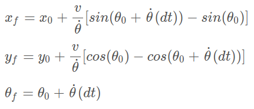
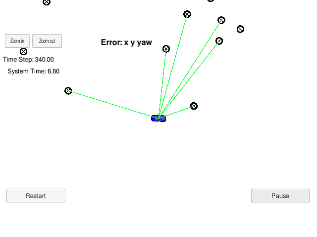
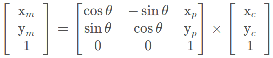
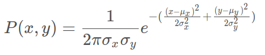

# Kidnapped Vehicle Project

## 0. Overview

### 0.1 Project Introduction
Your robot has been kidnapped and transported to a new location! Luckily it has a map of this location, a (noisy) GPS estimate of its initial location, and lots of (noisy) sensor and control data.

This project implements a 2 dimensional particle filter in C++. The particle filter is given a map and some initial localization information (analogous to what a GPS would provide). At each time step the filter gets an observation along with control data. 

### 0.2 Running the Code
This project involves the Term 2 Simulator which can be downloaded [here](https://github.com/udacity/self-driving-car-sim/releases)

This repository includes two files that can be used to set up and intall uWebSocketIO for either Linux or Mac systems. For windows you can use either Docker, VMware, or even Windows 10 Bash on Ubuntu to install uWebSocketIO.

Once the install for uWebSocketIO is complete, the main program can be built and ran by doing the following from the project top directory.

    $  mkdir build
    $  cd build
    $  cmake ..
    $  make
    $  ./particle_filter

## 1. Particle Filter Class

### 1.1 Initialize
The particle filter class uses a list of particles to track changes in position over time that have to be instantiated before the filter can begin. Using a large number of particles for the filter will result in a more accurate estimation of the world position however will ultimately slow down the process with large amounts of computational steps. Similarily, too few particles will result in faster computation time but less references to assist in localization. 

It is good practise to initialize all the particles with values from a random Gaussian sample based on the initalize position of the car and the standard deviation associated with the data value (x/y/theta). Now populate the list of particles in the particle filter with the number of desired number of particles.

    $  for (int i = 0; i < num_particles; i++) {
    $    // Create new particle.
    $    Particle particle;
    $    particle.id = i;
    $    particle.x = dist_x(gen);
    $    particle.y = dist_y(gen);
    $    particle.theta = dist_theta(gen);
    $    particle.weight = 1.0;
    $
    $    // Add particle to list.
    $    particles.push_back(particle);
    $
    $  }

In order to prevent the number of particles growing uncontrollabley and from instantiating multiple particles with the same id, only perform this step once and add a gaurd using `is_initialized` to catch such cases. 

### 1.2 Prediction
This step updates our belief of where all the particles are in the world coordinate frame by regenerating random Gaussian values for x, y, and theta based on the current velocity and yaw rate of the car. Using these estimates as the mean a Gaussian distribution is generated and a sample from each is set as the new particle postion estimate.

 

### 1.3 Data Association
In order to use the observed particle measurements from the lidar on the car it is essential to know which measurement value most likely corresponds to which particle in the filter. To determine this the nearest neighbour for each measurement is determined so an observed measurement does not interfere with an unassociated particle.

 

### 1.4 Update Weights
After updating the list of particles with their estimated position state from the prediction step, we know need to adjust the particle weights so that the more likely positions stand out from the rest. Here the landmarks in range of each particle are associated to the closest observation and then transformed into the map coordinates to test the likeliness of this particle being the true position.

#### 1.4.1 Transform Coordinates
For each particle we have a list of landmarks in range of the sensor but these are in the car coordinate system. In order to make a prediction on the car's position we have to translate these observations into the map coordinate frame to compare the particles' relative position to the known landmarks from the map. The matrix transformation is as follows:

 

Where *x_m* and *y_m* are map coordinates, *x_c* and *y_c* are car coordinates, and *x_p* and *y_p* are particle coordinates. This can be expressed in code as:

    $  x_t = x_p + cos(theta_p) * x_c - sin(theta_p) * y_c;
    $  y_t = y_p + sin(theta_p) * x_c + cos(theta_p) * y_c;

#### 1.4.2 Associate Data
With list of transformed observations in terms of map coordinates we can now call upon our data association function (Section 1.3) to set each observation to the id of the most likely (best matched) landmark from the map. 

#### 1.4.3 Determine Measurement Probability
For each particle in the list we now compare the observed coordinates in terms of the map coordinates to the actual landmark position and update the weight of this particle being the correct position using the following formula.

 

Which can be expressed in code as:

    $ weight = (1.0/(2.0*M_PI*sig_x*sig_y)) * exp(-(dx_2/(2.0*sig_x_2) + (dy_2/(2.0*sig_y_2))));

Once all the weights have been updated we need to normalize them in the range 0 and 1 so they can be used as probabilities for resampling.

    $ for (int i = 0; i < num_particles; i++)
    $   particles[i].weight /= max_weight;

### 1.5 Resample
Now that all the particle weights have been updated and normalized we can update the weights to the Bayesian probability function. For each particle we multiply all the calculated measurements together to get the final particle weight.

## 2.0 Tuning & Optimization
The project requirement is to maintain x, y, and theta error within an acceptable tolerance and complete the motion path before 100 seconds has elapsed. Ways to speed up the program run time is to reduce repeated calculations in loops by using constants, reducing the number of particles in the filter, and by avoiding heavy computational calculations where necessary (such as when calcuating distance to a landmark, use square value rather than computing square root). 

## 3.0 Running the Simulator

 

